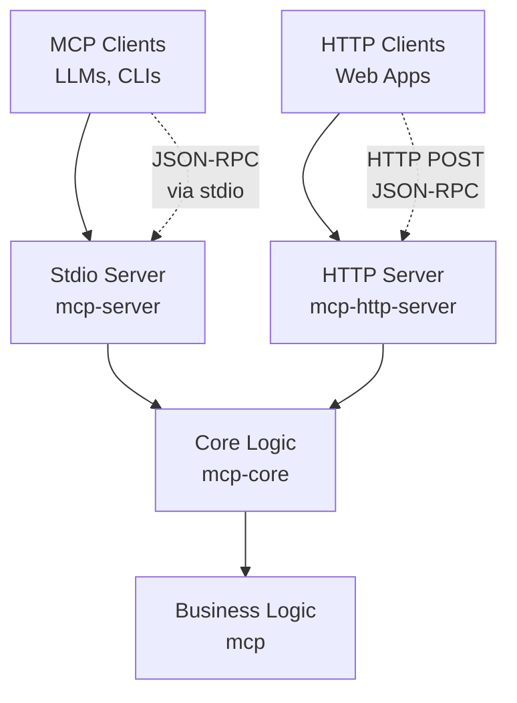

# MCP Token Cost Estimator

MCP Token Cost Estimator is a Model Context Protocol (MCP) server that provides token counting and cost estimation capabilities for Large Language Models (LLMs).

# What problem(s) does it strive to solve?

When working with LLMs, getting rough estimates of token counts and associated costs can be useful for:

- **Budget planning**: Getting approximate costs before sending requests to paid LLM APIs
- **Content optimization**: Understanding how text length affects processing costs
- **LLM integration**: Enabling AI systems to estimate processing costs for decision-making

This service provides a standardized way for LLMs and applications to get token count estimates and approximate cost calculations.

# Core abstractions

The service is built around three key abstractions:

1. **Token Estimation**: Core functionality for counting tokens in text using the Tolkien library with GPT-3.5-turbo tokenization
2. **Cost Calculation**: Precise cost computation using BigDecimal arithmetic for financial accuracy
3. **MCP Protocol**: Standardized Model Context Protocol for seamless integration with LLM systems

# Primary operations

The service exposes a single primary operation:

- **`estimate_cost`**: Accepts text and cost-per-million-tokens, returns token count and total cost
  - Input: `{text: string, cost_per_million_tokens: number}`
  - Output: `{token_count: integer, total_cost: decimal}`

# Architectural Components

The system consists of four main components:

1. **Core Logic** (`achilles.mcp-core`): Transport-agnostic MCP protocol implementation
2. **Stdio Server** (`achilles.mcp-server`): Traditional stdin/stdout MCP server for CLI integration
3. **HTTP Server** (`achilles.mcp-http-server`): Web-accessible HTTP server with CORS support
4. **Business Logic** (`achilles.mcp`): Token counting and cost estimation functions



**Dependencies:**
- Clojure 1.12.0
- Tolkien library for tokenization
- Ring/Jetty for HTTP server
- JSON processing libraries

# Is it simple?

Yes, the service follows "Simple Made Easy" principles:

- **Stateless**: No persistent state, each request is independent
- **Pure functions**: Core business logic uses pure functions for predictable behavior  
- **Modular design**: Clear separation between transport (stdio/HTTP) and business logic
- **No dependency cycles**: Linear dependency structure with shared core logic
- **Minimal complexity**: Single responsibility focused on token cost estimation

# Fundamental tradeoffs

## Benefits
- **Dual transport support**: Both stdio and HTTP interfaces maximize compatibility
- **Standard protocol**: MCP compliance enables seamless LLM integration
- **Lightweight**: Minimal dependencies and simple architecture

## Risks
- **Single tokenization model**: Currently hardcoded to GPT-3.5-turbo tokenization
- **No authentication**: HTTP server has no built-in security mechanisms
- **Synchronous processing**: No support for batch or asynchronous operations
- **Limited scalability**: Single-threaded design may not handle high concurrent loads

# Key indicators for use

This service is a good fit when:
- You need token cost estimation for GPT-style models
- You want MCP-compliant integration with LLM systems
- You require both programmatic (CLI) and web-based access
- You need a lightweight, stateless service

# Key indicators against use

This service is a poor fit when:
- You need tokenization for non-GPT models
- You require authentication or advanced security
- You need very precise cost estimates
- You need high-throughput, concurrent processing  
- You want persistent storage or state management
- You need complex text processing beyond token counting

# Other relevant characteristics

**Performance**: Low latency for typical text inputs (< 1MB), O(n) complexity with text length
**Security**: No built-in authentication - suitable for internal networks or with external security layers
**Scalability**: Designed for moderate loads; consider load balancing for high-traffic scenarios

# Getting Started

## Running the servers

### Stdio MCP Server (for LLM integration)
```bash
clojure -M:mcp-server
```

### HTTP Server (for web applications)  
```bash
clojure -M:mcp-http-server          # Default port 3000
clojure -M:mcp-http-server 8080     # Custom port
```

## Using the estimate-cost function directly
```bash
clojure -X:run-x :text '"Your text here"' :cost-per-million 3.0
```

## Example HTTP request
```bash
curl -X POST http://localhost:3000 \
  -H "Content-Type: application/json" \
  -d '{
    "jsonrpc": "2.0",
    "id": 1,
    "method": "tools/call",
    "params": {
      "name": "estimate_cost",
      "arguments": {
        "text": "Hello world!",
        "cost_per_million_tokens": 3.0
      }
    }
  }'
```

## Development

### Testing
```bash
clojure -T:build test
```

### Building
```bash
clojure -T:build ci
java -jar target/mcp-0.1.0-SNAPSHOT.jar
```

# Resources

- [Model Context Protocol Specification](https://modelcontextprotocol.io/)
- [Tolkien Tokenization Library](https://github.com/lukaszkorecki/tolkien)
- [Clojure Tools Build](https://clojure.org/guides/tools_build)
